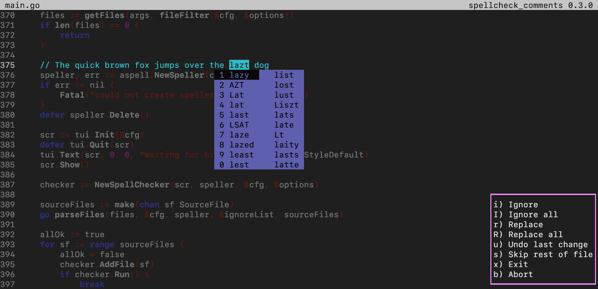
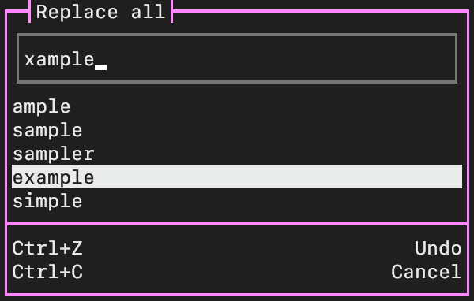

# spellcheck_comments

Interactive spell checker for source code comments.



## Description

This program is based on the GNU Aspell program and like it uses the Aspell library to check words.
However unlike Aspell it only checks the words inside comments in source code files.

## Building

Build: `go build`

Install: `go install` (this installs it to `$HOME/go/bin/spellcheck_comments`)

### Dependencies

The go compiler and Aspell library.

Optionally: A program to highlight the source code like `source-highlight` or `pygmentize`.

## Usage

Behavior is similar to Aspell but there a few key differences:

- There is a different layout which splits the suggestion and action lists and shows the suggestion right under the words (this is shown in the screenshot).
The classic Aspell layout is also available.

- It can and is intended to run on whole projects (directories).

- There is a skip files action which skip the rest of a file and moves onto the next.

- There is an undo action which reverts the last action.

- The suggestion list can be navigated using the arrow keys (or the HJKL vim keys),
the selected suggestion is chosen using Enter or Space.

- The suggestion and action lists can also be interacted with using the mouse.

The first 10 suggestions can still be selected using the 1~0 keys.
The action key bindings can be seen in the above screenshot.
Additionally `Ctrl-C` is bound to the Abort action and `Ctrl-Z` to Undo.

### "Replace all" widget



While the text input is focused, text can be entered or deleting using backspace.
If the down arrow is pressed the suggestion list is focused, this behaves like
the normal selection list, going up again when the first suggestion is selected
moves the focus back to the text input.

## Word rules

Filtering and case sensitivity is defined in the [configuration](#configuration).

In addition to those rules the following words are always ignored:

- Javadoc/Doxygen tags (any words starting with `@` or `\`) are always ignored.

- The words `TODO` and `FIXME` (if case sensitive, only in all uppercase)

## Filtering of commented out code

This can be disable using the `general.filter-commented-code`  option or `-fcc` argument.
It will try to detec if a comment is commented code and will not check any words inside those comments.

The detection is mostly based on the last character in each line and is especially intended for languages using curly braces and/or semicolons.
Comments containing other comments (for example a line comment within a block comment) will also heavily influence the detection.

## Arguments

Synopsis:
```
spellcheck_comments [OPTION]... [FILE]...
```

The given paths can be either files or directories,
if a directory is given it is recursively searched for files for which a comment style is configured.
If no files are provided the current directory is used by default.

### Options

- `-b`, `-apply-backup` Interactively applies the backup file created by a previous run, asking for each file

- `-B`, `-apply-backup-all` Reverts all the changes in the backup file created by a previous run,
files that have been changed since that run are skipped

- `-with-backup` Enables generation of a backup, even if disabled in the configuration

- `-globs GLOB[,GLOB]...` A comma separated list of globs to filer when searching directories.
If this option is absent all files with configured comment styles are used.

- `-dump-styles` Dump all configured styles to standard output and exit

- `-fcc` Enable filtering of commented code, event if disable in the configuration

- `-help` Show the option help message

## Configuration

The config directory is either `$XDG_CONFIG_HOME` or `$HOME/.config` if the former is not defined.

The config file can either be `spellcheck_comments.toml` or `spellcheck_comments/config.toml`, relative to the config directory.

The config documentation can be found [here](./doc/CONFIGURATION.md).

## License

`BSD-2-Clause`
